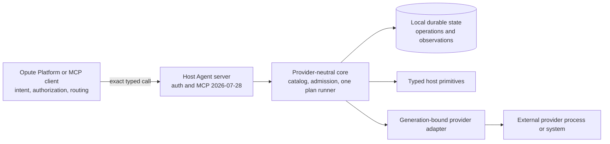

# Design: behavior-preserving Rust Host Agent

## Evidence and authority

The initial source is `wunderous/host-agents` commit
`ace7013df17528fee1bed13a1d70a132d6c5eb9b`, tree
`ac17cfb298f789095e7a3af2219837e3490f798a`. The checked-in
`baseline/source-lock.json` records its public v0.2.3 catalog revision. The
public release snapshot has 142 descriptors; `schemas/all-tools.json` has 115
entries. They are different projections. Neither count is an exhaustive
runtime parity test. An authenticated `tools/list` capture per supported mode
and active provider set, combined with the pinned schemas and contract tests,
is the catalog authority for implementation.

The governing Go references are its `AGENTS.md`,
`docs/cordis-development-guide.md` (C-01–C-24), ADRs 0006–0013,
`README.md`, versioned `contracts/` and `schemas/`, `internal/state/`,
`internal/plan/`, `internal/hostmcp/`, and provider modules. The Platform's
permanent-invariant guide controls cross-repository ownership. If prose and
typed behavior disagree, record and resolve that conflict before coding the
Rust seam. The abandoned Rust port has no authority in this design and will
not be copied.

OpenSpec marks this change `skip_specs: true` because the requested outcome is
contract-preserving. The main `host-agent-contract` spec is a migration
acceptance baseline, not a claim that a Rust agent already exists. Any desired
external change must be a separate proposal with a real spec delta.

## Architectural shape

Start with a small Rust workspace rather than one crate per Go package:

| Boundary | Candidate owner | Responsibility |
| --- | --- | --- |
| Versioned contracts | `crates/contracts` and language-neutral `contracts/` | Canonical capability descriptors, schemas, resource kinds, versions, and deterministic projections |
| Provider-neutral core | `crates/core` | Catalog, typed admission, one plan runner, recipe interpretation, generation lifecycle, task and observation contracts |
| Host execution | `crates/host` | Local host primitives behind narrow typed seams; no Platform intent or provider-name routing |
| Transport and composition | `crates/server` | CLI, configuration, HTTP/MCP adapters, auth boundary, startup/shutdown wiring, binary entrypoint |
| External providers | Separate processes only where the current provider contract requires them | Concrete K3s, Cloudflare, Tailscale, LLM, and other implementations behind neutral contracts |

These are ownership candidates, not a mandate to create every crate before a
second real consumer exists. Keep private Rust modules inside an owner until
an actual dependency or build boundary justifies extraction. Traits represent
declared seams (clock, state repository, provider transport, host primitive),
not speculative abstraction. Do not translate Go package names one for one.

The diagram is an ownership map, not a new runtime hop. MCP and HTTP details
end at the transport adapter; the core receives typed calls, effects, task
state, and observations. Platform never becomes a library inside the Host
Agent. A provider callback uses the public admitted primitive path and retains
the verified parent task reservation, generation, and cancellation contract.

## Simplification rules

1. **One descriptor authority.** Keep each tool's schema, effect, idempotency,
   resource bindings, and provider-neutral name in one versioned descriptor.
   Generate Rust decoding, MCP publication, reference data, and parity
   comparison from it. Do not maintain a second handwritten tool table.
2. **One execution path.** Recipe validation produces a typed plan for the
   single executor. Providers supply operations and observations, not their
   own workflow engine. Admission occurs before side effects and remains
   generation-bound through task completion.
3. **Explicit composition.** Startup declares dependencies, opens resources in
   order, publishes a provider candidate only after readiness and catalog
   checks, and disposes in reverse order on failure or shutdown. No hidden
   global provider registry or mutable-current lookup after a task is admitted.
4. **Typed failures and evidence.** Internal error types retain the Go
   boundary's externally visible status/category and structured fields.
   Schema-derived redaction is applied before any durable or client-visible
   projection; unknown projections fail closed. Do not add name-based or
   regex-based compatibility branches.
5. **Storage stays local.** The current Go agent uses local SQLite state for
   plans, operations, generations, and observations. Rust may reorganize
   repositories and migrations, but it must preserve that local state meaning.
   No consensus database or Platform state is moved into the Host Agent.

## Parity inventory and comparison

Before implementing a slice, record the exact Go source revision and capture
the following into a machine-readable inventory with provenance, mode, active
provider set, and catalog revision:

- CLI commands, flags, environment precedence, defaults, exit codes, help and
  check mode; standalone and platform startup and listener behavior;
- `/health` and `/mcp` routes, authentication methods and 401 behavior,
  protocol headers, `server/discover`, `tools/list`, `tools/call`, Tasks,
  cancellation, result shapes, terminal events, and the bounded opt-in legacy
  handshake exception of ADR 0011;
- every public and conditional descriptor: name, version, title/description,
  input/output schema, effect, approval, idempotency, resource bindings, and
  catalog revision; no equality assertion between catalogs with different
  active providers;
- recipes and plans: accepted documents, hashes, bindings, statuses, retry
  policy, readiness, compensation, cancellation, resume, and typed failures;
- providers: installation, candidate/active/draining generations, neutral
  tool mapping, callbacks, Tasks bridge, readiness, and disposal;
- durable schemas and restart outcomes, secret redaction, file permissions,
  state backup/restore, and migration failure behavior; and
- npm launcher, Linux release archives and checksums, installer and systemd
  contract, schema export, and operator documentation commands.

Compare canonical JSON/schema structures, not textual key order. Mask volatile
values only through declared typed fields; a regex that ignores unknown
differences would hide regressions. A mismatch becomes a failing parity item
with a named owner and a decision: fix Rust, correct an evidenced Go defect in
both implementations, or propose a separate product change. The refactor does
not silently bless changed behavior.

## Implementation and validation sequence

Build in slices so failures are attributable: contracts/catalog and transport;
identity/admission and read-only host operations; provider lifecycle; plan and
mutation paths; durable state and recovery; packaging and Platform integration.
These are development milestones, not partial production ownership. Go serves
the complete production surface until a whole-agent gate passes. A Rust
validation instance uses a distinct opaque identity, endpoint, credentials,
state directory, and resource fixture; it never shares mutable state with Go.

For each slice, run the owning Go focused tests as a reference, Rust unit and
contract tests, and separate-process MCP wire tests. For effects, use fresh,
isolated equivalent fixtures and compare external state after execution and
cleanup; never run competing Go and Rust mutations against one resource. Test
failure, cancellation, timeout, restart, stale revision, approval, provider
replacement, and secret handling as well as the happy path. The published
artifact and an actual client path must be exercised before cutover. Health,
HTTP 200, compile success, or a tool name in a static file cannot substitute
for these boundary checks.

## Durable-state transition and rollback

1. Inventory every Go state store and schema at the selected cutover revision.
   Verify backups and checksum a read-only copy; never test conversion on the
   only live copy.
2. Build a versioned converter with a dry run. It must account for operations,
   tasks, plans, provider generations, redacted evidence, and all unknown or
   in-flight states. A failed or ambiguous record blocks cutover instead of
   being dropped or treated as successful.
3. Rehearse stop, snapshot, convert, start Rust, query through MCP, and restart
   on an isolated copy. Check terminal and pending state, identity, catalog
   revision, record counts, hashes, and redaction. Preserve the original Go
   files read-only through the rollback window.
4. Define a rollback procedure that stops Rust before restoring the Go writer.
   Never let both processes write one state directory. A rollback must either
   import Rust-era writes safely through an approved converter or explicitly
   refuse rollback and halt; it cannot silently discard accepted operations.

The cutover plan must define how to handle in-flight work and a bounded
rollback window before any production switch. Go retirement follows a separate
decision only after the window and evidence close.

## Release and ownership boundaries

The public `wunderous/host-agents` repository currently owns npm packaging,
release artifacts, the documentation generator, and the site image. The
private `wunderous/opute-site-deploy` repository owns site deployment through a
typed Host Agent recipe. Opute Platform owns registration and routing. This
specification changes none of those owners. At cutover, update only the
artifact/source links and docs needed to keep the existing operator journey
working, with release-parity canaries and private deployment gates intact.
Do not move credentials, controller logic, or a self-hosted runner into the
new Rust repository.

## Invariant delta

| Class | Statement and owner | Authority and evidence |
| --- | --- | --- |
| Preserve | Canonical identity, typed resource/effect admission, provider-neutral catalog, generation affinity, one executor, MCP opacity, schema-redacted evidence, and Host Agent/Platform ownership remain unchanged. Owners: Host Agent contracts and Platform routing. | Pinned Go contracts/ADRs and `host-agent-contract` spec; differential contract, wire, state, and E2E evidence at each boundary. |
| Introduce | No Rust slice may be promoted or used to retire Go without a complete, provenance-bound parity inventory and passing boundary-matched gates. Owner: this Rust repository's release process. | Proposed typed decision `.agents/decisions/rust-cutover-parity-gate.json`; task 0.5 must make its verifier active before runtime promotion. |
| Retire | None. | A later removal requires its own OpenSpec delta, owner decision, and migration evidence. |

This new parity gate is an implementation governance invariant, not a product
capability. The typed decision is proposed and explicitly unverified. Its
verifier is an implementation task; this planning repository does not claim it
already proves runtime parity or authorizes a cutover.

## Risks and unresolved decisions

- The abandoned Rust port remains on disk but is excluded from this change.
  The selected target and pinned Go contracts are the only implementation
  starting points.
- Go may change while Rust is developed. Every changed Go contract requires a
  reviewed baseline rebase and matching Rust evidence; pinning one commit is
  not permission to ship an older product surface.
- The exact state conversion and rollback strategy depends on a full store
  inventory. No production cutover is authorized until that inventory and
  rehearsal are complete.
- Release repository and website ownership after Go retirement require an
  explicit future decision. Current ownership remains in force meanwhile.
